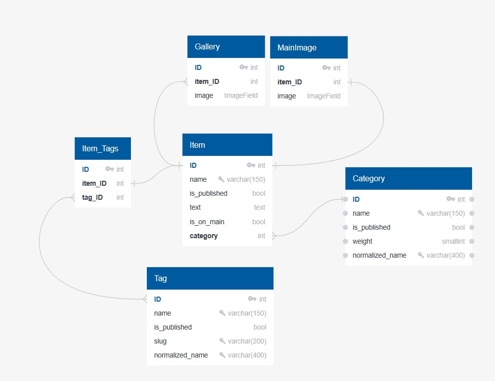

[]
# django-spec-1

## Инструкция по запуску проекта:

#### Клонирование репозитория
- Клонируйте репозиторий перед началом работыы
```bash
git clone <url репозитория>
```

#### Создание и активация *venv*

- Перед работой необходимо создать и активировать виртуальное окружение следующими командами: 
```bash
python3 -m venv venv
source venv/bin/activate
```

#### Локальный запуск

- Перейти в директорию проекта и запустить его
```bash
cd lyceum
```
```bash
python3 manage.py runserver
```

#### Использование .env

- Для работы необходимо заполнить переменные окружения в файле *.env*.
- В качестве примера можно использовать файл *.env.example*
- ```DJANGO_DEBUG``` принимает значения **True** *(так же принимаются ```true```, ```t```, ```y```, ```yes```, ```1```)* или **False** 
- ```DJANGO_ALLOWED_HOSTS``` - список хостов, разделенных через символ запятой (без пробела)```,```
- В случае указания ```DJANGO_DEBUG = False``` не забудьте указать разрешенные хосты в качестве списка.

#### Зависимости проекта

 - Для запуска проекта в dev-режиме: *requirements/dev.txt*
 ```bash
 pip install -r requirements/dev.txt
 ```
 - Для тестирования проекта: *requirements/test.txt*
 ```bash
 pip install -r requirements/test.txt
 ```
 - Для уcтановки основных зависимостей: *requirements/prod.txt*
 ```bash
 pip install -r requirements/prod.txt
 ```

 #### Миграции базы данных
 - Для установки миграций используйте:
 ```bash
 cd lyceum
 python3 manage.py migrate
 ```
 - Если вы внесли изменения в структуру базы данных, то сделайте новую миграцию:
 ```bash
 cd lyceum
 python3 manage.py makemigrations
 ```

 ## Настройка переводов
 - Для настройки переводов на определенный язык необходимо выполнить следующую очередность действий:
 1. В файле `settings.py` в переменную `LANGUAGES` добавить кортеж вида `("<код языка>", _("<название языка (на языке, укзанном в LANGUAGE_CODE)>")),`
 2. Убедиться, что существует файл `locale` в корне проекта или в одном из приложений
 3. Создать файл `.po` с переводами следующей командой (находясь в директории с файлом `manage.py`)
 ```bash
 django-admin makemessages -a
 ```
 4. В файле `locale/<код языка>/LC_MESSAGES/django.po` отредактировать перевод фраз
 5. Скомпиллировать переводы следующей командой:
 ```bash
 django-admin compilemessages --ignore=venv
 ```
 (В директории venv также содержатся файлы .po, которые могут помешать нам. Их следует игнорировать)

 ## Диаграмма базы данных
 
 
